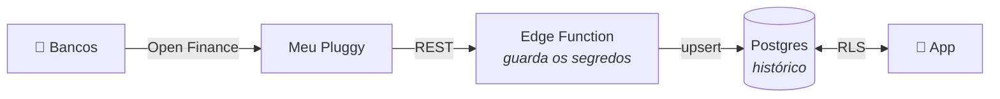

# Banco Fiscal

Controle de gastos familiar que lê os extratos bancários por Open Finance,
organiza por categoria e mostra num aplicativo Android que se instala uma vez
e funciona sem ninguém precisar mexer em nada.

Feito para uma família de verdade: o pai e a mãe abrem o app e enxergam para
onde o dinheiro está indo no mês, sem planilha, sem digitar nada.



## O que ele faz

| Tela | |
|---|---|
| **Resumo** | Quanto saiu no mês, quanto entrou, quanto sobrou, barras por categoria e os maiores gastos |
| **Gastos** | Extrato agrupado por dia, com busca e filtros por categoria |
| **Contas** | Saldos das contas e faturas dos cartões |
| **Ajustes** | Orçamento mensal por categoria |

Mais a edição de cada lançamento — categoria, quem gastou, observação — e o
registro de gastos em dinheiro, que banco nenhum enxerga.

### Três coisas que ele resolve bem

**Suas edições sobrevivem à sincronização.** Categorizar um gasto não é
trabalho perdido: o sincronizador regrava só o que vem do banco e não encosta
no que a família organizou.

**Transferência não é gasto.** Mandar dinheiro entre contas próprias inflaria
gasto e receita ao mesmo tempo. Marque "não contar nos totais" e a transação
sai das somas sem sair do histórico.

**A categorização aprende.** Ao classificar um gasto, a opção *"sempre
categorizar assim"* cria uma regra, e as próximas sincronizações já chegam
prontas.

## Como está construído

```text
mobile/                   aplicativo Expo (React Native)
  src/app/                telas — cada arquivo é uma rota
  src/components/         peças de interface
  src/lib/                estado, formatação, tema, cliente Supabase

supabase/
  migrations/             schema, RLS e categorias iniciais
  functions/sync-pluggy/  a única peça que conhece a Pluggy
  opcional/               agendamento da sincronização

scripts/                  cadastro de membros da família
docs/                     documentação
```

A regra que orienta todo o desenho: **as credenciais bancárias nunca entram no
aplicativo.** Um APK é um arquivo ZIP — extrair strings dele é trivial. Por
isso existe uma Edge Function no meio: ela guarda os segredos, conversa com a
Pluggy e grava no banco o resultado já traduzido. O app só lê tabelas, sob Row
Level Security.

## Bibliotecas e serviços

### Aplicativo

| Biblioteca | Versão | Para quê |
|---|---|---|
| [expo](https://docs.expo.dev) | ~57.0.25 | Plataforma e build (EAS) |
| [react-native](https://reactnative.dev) | 0.86.3 | Base do app nativo |
| [react](https://react.dev) | 19.2.3 | Biblioteca de UI |
| [expo-router](https://docs.expo.dev/router/introduction/) | ~57.0.23 | Navegação por arquivos |
| [@supabase/supabase-js](https://supabase.com/docs/reference/javascript) | ^2.117.2 | Login e acesso ao banco |
| [@react-native-async-storage/async-storage](https://react-native-async-storage.github.io/async-storage/) | 2.2.0 | Guarda a sessão no aparelho |
| [react-native-url-polyfill](https://github.com/charpeni/react-native-url-polyfill) | ^4.0.0 | `URL` que o supabase-js exige |
| [@expo/vector-icons](https://icons.expo.fyi) | ^15.0.2 | Ícones das abas |
| [react-native-safe-area-context](https://github.com/th3rdwave/react-native-safe-area-context) | ~5.7.0 | Respeita notch e barras |
| [react-native-screens](https://github.com/software-mansion/react-native-screens) | ~4.26.0 | Telas nativas na navegação |
| [react-native-reanimated](https://docs.swmansion.com/react-native-reanimated/) | 4.5.1 | Animações das transições |
| [react-native-gesture-handler](https://docs.swmansion.com/react-native-gesture-handler/) | ~2.32.0 | Gestos da navegação |
| [expo-font](https://docs.expo.dev/versions/latest/sdk/font/) | ~57.0.4 | Fontes dos ícones |
| TypeScript | ~6.0.3 | Tipagem |

Os gráficos de barras são `View` com largura proporcional — nenhuma biblioteca
de charts. Para desenhar retângulos, uma dependência a mais não se pagaria.

### Servidor

| | Para quê |
|---|---|
| [Supabase](https://supabase.com) | Postgres, autenticação, RLS e Edge Functions |
| [Deno](https://deno.com) | Runtime da Edge Function |
| [Pluggy](https://pluggy.ai) | Open Finance — traz os extratos |

No sincronizador não há dependência externa além do cliente Supabase: a
conversa com a Pluggy é `fetch` puro.

## Documentação

| | |
|---|---|
| [Instalação](docs/instalacao.md) | Do zero ao app rodando, passo a passo |
| [Arquitetura](docs/arquitetura.md) | Como as peças se encaixam e por quê |
| [Modelo de dados](docs/modelo-de-dados.md) | As sete tabelas, coluna por coluna |
| [Sincronização](docs/sincronizacao.md) | A integração com a Pluggy e suas armadilhas |
| [Segurança](docs/seguranca.md) | Onde vivem os segredos e o que protege o quê |
| [Operação](docs/operacao.md) | Gerar o APK, agendar, investigar problemas |

> A integração com a Pluggy tem cinco armadilhas que não estão na
> documentação oficial — endpoints descontinuados, um 401 que não é de
> credencial e um cursor que quebra se for re-codificado. Estão todas
> registradas em [sincronização](docs/sincronizacao.md), com o erro exato que
> cada uma produz.

## Começando

```bash
git clone <este-repositório>
cd banco-fiscal/mobile
cp .env.example .env     # preencha com seu projeto Supabase
npm install
npx expo start
```

O app sozinho não faz nada: ele depende do banco e da Edge Function. O
caminho completo está em [instalação](docs/instalacao.md).

## Limites conhecidos

- **5 conexões bancárias, todas do mesmo CPF** — limite do plano gratuito do
  Meu Pluggy. Cobre as contas de uma pessoa mais lançamentos manuais de todos.
- **Uma família por instalação** — o RLS pressupõe que todos veem tudo.
- **Sincronização puxada** — os dados chegam pelo botão ou pelo agendamento,
  não por webhook.

## Licença

MIT — veja [LICENSE](LICENSE).
