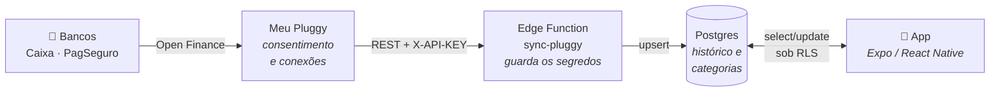
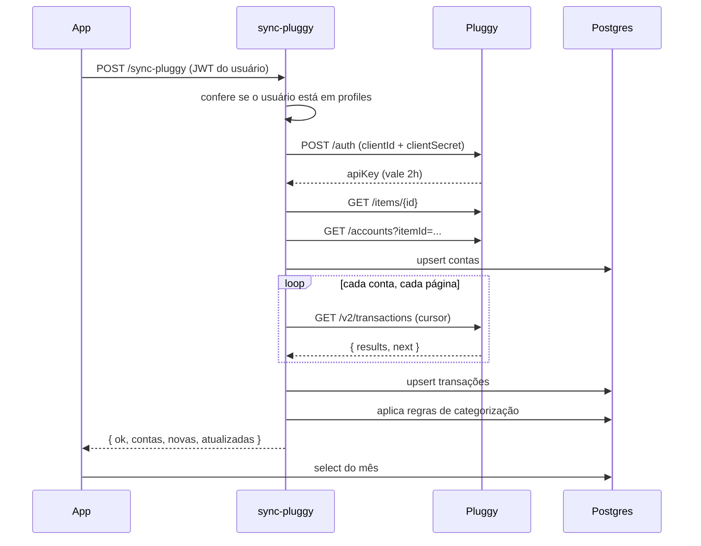

# Arquitetura

## O problema

Uma família quer enxergar num só lugar para onde o dinheiro está indo. Os
dados existem — estão no extrato do banco —, mas chegar até eles envolve um
obstáculo que define todo o resto do desenho: **as credenciais que dão acesso
ao extrato não podem ficar no celular.**

Um APK é um arquivo ZIP. Qualquer pessoa com o arquivo extrai as strings de
dentro dele em segundos. Se o `clientSecret` da Pluggy estivesse ali, quem
pegasse o telefone emprestado teria acesso ao histórico bancário completo.

Daí a forma do sistema: existe um servidor no meio, e ele é a única peça que
conhece o segredo.

## As quatro peças

| Peça | Responsabilidade | Onde roda |
|---|---|---|
| **Meu Pluggy** | Guarda o consentimento e as conexões bancárias | Serviço da Pluggy |
| **sync-pluggy** | Traduz a API da Pluggy para o nosso modelo | Deno, na Supabase |
| **Postgres** | Histórico, categorias, orçamentos, regras | Supabase |
| **App** | Leitura e edição pela família | Android e iOS |

## Por que não ligar o app direto na Pluggy

Seria menos peças. E seria errado por três motivos:

**O segredo vazaria.** Já explicado — é o motivo determinante.

**Não haveria memória.** A Pluggy devolve o extrato como o banco o conta. Ela
não sabe que a família classificou aquele débito como "Mercado", nem que
aquela transferência não conta como gasto. Sem um banco nosso, cada abertura
do app perderia tudo que as pessoas organizaram.

**Não haveria dinheiro vivo.** A feira paga em espécie não aparece em extrato
nenhum. Ela precisa de um lugar para ser lançada à mão, e esse lugar é a mesma
tabela onde moram as transações do banco — para que somar uma coluna baste.

## O fluxo de uma transação

## Decisões e seus motivos

### O sinal do valor é nosso, não da Pluggy

A Pluggy devolve `amount` sempre positivo e indica a direção num campo
separado, `type: DEBIT | CREDIT`. Guardar assim obrigaria toda consulta a
carregar um `CASE` para saber se soma ou subtrai.

Normalizamos na entrada: **negativo saiu, positivo entrou**. Somar uma coluna
passa a ser suficiente em qualquer tela, e o risco de alguém esquecer o sinal
numa consulta futura desaparece.

### A sincronização não sobrescreve o trabalho humano

Quando o sincronizador regrava uma transação que já existe, ele manda apenas
os campos que vêm do banco. `categoria_id`, `pessoa`, `observacao` e
`ignorada` ficam **fora do payload de propósito** — o `ON CONFLICT DO UPDATE`
do PostgREST só toca nas colunas presentes, então o que a família editou
sobrevive.

É uma escolha frágil por natureza: quem adicionar um campo novo ao upsert sem
perceber apagará edições. Por isso o comentário está no código, ao lado do
payload, e não só aqui.

### Transferências existem mas não contam

Mandar dinheiro do Caixa para o PagSeguro aparece como saída de um lado e
entrada do outro. Somados, os dois inflam gasto e receita sem que nada tenha
sido gasto de fato.

A coluna `ignorada` resolve sem apagar: a transação continua no histórico,
visível e auditável, mas sai de todas as somas.

### Agregação no cliente, não no banco

Os totais por categoria são calculados em JavaScript, não por uma view SQL.
Para uma família, um mês tem algumas centenas de linhas — o custo é
irrelevante, e a alternativa exigiria views com `security_invoker` para não
furar o RLS. Menos superfície para errar.

### Gráficos sem biblioteca de gráficos

As barras por categoria são `View` com `width` percentual. Uma biblioteca de
charts traria dependência nativa, peso no APK e uma API para aprender — tudo
isso para desenhar retângulos proporcionais.

## Limites conhecidos

**Cinco conexões, um titular.** O plano gratuito do Meu Pluggy aceita até 5
conexões ativas, todas do **mesmo CPF**. As contas dos pais são outro titular,
então o modelo atual cobre as contas de uma pessoa mais os lançamentos manuais
de todos. Estender exigiria uma conta Meu Pluggy por pessoa e um sincronizador
que percorra vários pares de credenciais — hoje ele lida com um só.

**Sincronização é puxada, não empurrada.** Os dados chegam quando alguém
aperta o botão ou quando o agendamento roda. A Pluggy oferece webhooks; não
usamos, porque exigiriam um endpoint público e a latência não importa aqui.

**Sem multi-família.** O RLS pressupõe que todo mundo em `profiles` enxerga
tudo. É exatamente o que uma família quer e exatamente o que impediria o
projeto de servir a duas.
