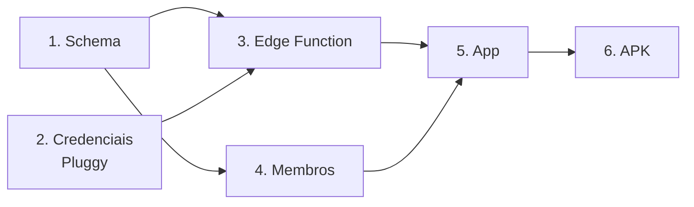

# Instalação

Do zero até o app rodando no celular. Leva entre 30 e 60 minutos na primeira
vez, e boa parte disso é esperar.

Os comandos estão em **cmd.exe** do Windows (prompt `C:\...>`). Onde o
PowerShell difere, está anotado.

## Antes de começar

| | Conta | Custo |
|---|---|---|
| 1 | [Meu Pluggy](https://meu.pluggy.ai) com os bancos conectados | grátis |
| 2 | [Dashboard Pluggy](https://dashboard.pluggy.ai) — mesma conta | grátis |
| 3 | [Supabase](https://supabase.com) | plano grátis basta |
| 4 | [Expo](https://expo.dev) — só para gerar o APK | grátis |

Node.js 20 ou superior. Nada além disso precisa ser instalado: tudo roda por
`npx`.

---

## 1. Banco de dados

Crie um projeto no Supabase. Guarde a **senha do banco** que ele pede — é
chata de recuperar depois.

Abra o **SQL Editor**, cole o conteúdo de
[`supabase/migrations/0001_schema.sql`](../supabase/migrations/0001_schema.sql)
e clique em **Run**.

Esperado: `Success. No rows returned`.

**Confira:** em **Table Editor** devem aparecer 7 tabelas, e `categorias` com
13 linhas.

> A alternativa por CLI (`npx supabase@latest link` seguido de `db push`)
> funciona, mas exige a senha do banco. O SQL Editor não depende de nada.

---

## 2. Credenciais da Pluggy

1. Conecte seus bancos em [meu.pluggy.ai](https://meu.pluggy.ai)
2. Entre no [dashboard.pluggy.ai](https://dashboard.pluggy.ai) com a **mesma
   conta** e abra **Aplicações**
3. Use a aplicação **Pluggy Demo App**, que já vem criada — não crie uma nova,
   isso levaria à trilha de produção comercial
4. Clique no **▷** da linha dela para abrir o widget de conexão
5. No seletor de instituição, busque por **Meu Pluggy** e entre com o e-mail e
   senha da **sua conta Meu Pluggy** (não a do banco)
6. Terminado, a conexão aparece na aplicação com status **Atualizado**
7. Anote o **Item ID** mostrado no topo do item
8. Em **Aplicações**, copie o `Client ID` e revele o `Client Secret` no **👁**

> **Ignore o aviso de "trial expirado".** Ele é da trilha comercial. Uso
> pessoal via Meu Pluggy é grátis por tempo indeterminado.

---

## 3. Edge Function

```bat
npx supabase@latest login
npx supabase@latest link --project-ref SEU_PROJECT_REF
```

O `project-ref` é o trecho da URL do painel:
`supabase.com/dashboard/project/`**`aqui`**.

Os segredos vão **por arquivo**, nunca por argumento — um segredo com espaço,
vírgula, `&` ou `|` é quebrado pelo shell e produz
`Invalid secret pair ... Must be NAME=VALUE`:

```bat
copy supabase\.env.secrets.example supabase\.env.secrets
notepad supabase\.env.secrets
```

Preencha (sem aspas em volta dos valores — o arquivo é lido literalmente):

```text
PLUGGY_CLIENT_ID=o-client-id-do-passo-2
PLUGGY_CLIENT_SECRET=o-client-secret-do-passo-2
CRON_SECRET=invente-algo-longo-sem-espacos
PLUGGY_ITEM_IDS=o-item-id-do-passo-2
```

```bat
npx supabase@latest secrets set --env-file supabase/.env.secrets
npx supabase@latest secrets list
npx supabase@latest functions deploy sync-pluggy --use-api --no-verify-jwt
```

- `--use-api` empacota no servidor e **dispensa o Docker**
- `--no-verify-jwt` é necessário para o agendamento funcionar; a função tem
  autenticação própria — ver [segurança](seguranca.md)

### Teste

A CLI **não tem** `functions invoke`. Chame por HTTP:

```bat
curl -X POST "https://SEU-PROJETO.supabase.co/functions/v1/sync-pluggy" -H "x-cron-secret: SEU_CRON_SECRET" -H "Content-Type: application/json" -d "{}"
```

Esperado:

```json
{"ok":true,"conexoes":1,"contas":2,"novas":229,"atualizadas":0,"categorizadas":0,"desde":"2026-06-27"}
```

Deu erro? A tabela em [sincronização](sincronizacao.md#diagnóstico) lista cada
mensagem e sua causa.

---

## 4. Cadastrar a família

Cada pessoa precisa de um login **e** de uma linha em `profiles`. Sem a
segunda, ela entra e vê um app vazio, sem mensagem de erro.

Pegue a **service_role key** em **Configurações → Chaves de API**.

```bat
set "SUPABASE_URL=https://SEU-PROJETO.supabase.co"
set "SUPABASE_SERVICE_ROLE_KEY=a-service-role-key"

node scripts/criar-membro.mjs "voce@email.com" "umaSenhaBoa123" "Seu Nome"
node scripts/criar-membro.mjs "pai@email.com" "outraSenha456" "Pai"
node scripts/criar-membro.mjs "mae@email.com" "maisUmaSenha78" "Mãe"
```

No PowerShell as variáveis mudam de sintaxe:

```powershell
$env:SUPABASE_URL="https://SEU-PROJETO.supabase.co"
$env:SUPABASE_SERVICE_ROLE_KEY="a-service-role-key"
```

Rodar de novo com o mesmo e-mail **redefine a senha** — é assim que se
recupera um acesso perdido.

> Prefira senhas só com letras e números neste passo. O `!` e o `%` podem ser
> alterados pelo cmd antes de chegar ao script, e aí a senha gravada não é a
> que você digitou.

> A `service_role` ignora o RLS por completo. Só na sua máquina, nunca no app,
> nunca no repositório.

---

## 5. Rodar o app

Copie a **URL do projeto** e a **anon key** (ou `sb_publishable_...`) da mesma
tela de chaves.

```bat
cd mobile
copy .env.example .env
notepad .env
```

```text
EXPO_PUBLIC_SUPABASE_URL=https://SEU-PROJETO.supabase.co
EXPO_PUBLIC_SUPABASE_ANON_KEY=a-anon-key
```

```bat
npm install
npx expo start
```

Instale o **Expo Go** no celular e escaneie o QR Code.

### Se o Expo Go reclamar de conta

> *"You're signed in to Expo Go as X, but not signed in to Expo CLI."*

O app e a CLI precisam estar na mesma conta. Duas saídas:

```bat
npx expo login -u "seu_usuario" -p "sua_senha"
```

O prompt interativo do `npx expo login` **não funciona no cmd.exe** — ele
devolve o usuário vazio e falha com `The expression evaluated to a falsy
value: (username && password)`. Por isso os parâmetros `-u` e `-p`.

Contas criadas via GitHub ou Google não têm senha; nesse caso use
`npx expo login -b`, que abre o navegador.

Ou, mais simples: **saia da conta no Expo Go** (aba de perfil → Log Out).
Deslogado, ele abre projetos locais sem exigir correspondência.

---

## 6. Gerar o APK

Só depois de ver o app funcionando. Ver [operação](operacao.md#gerar-o-apk).

---

## Ordem de dependência

Se algo falhar, este grafo diz o que precisa estar pronto antes:


