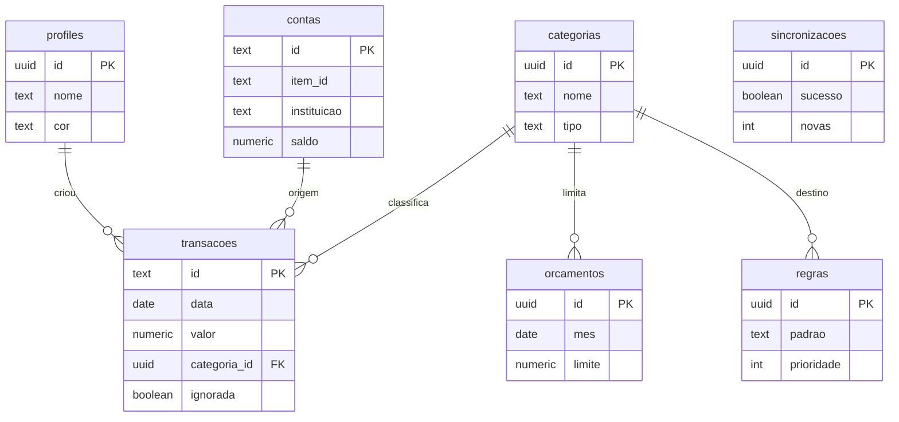

# Modelo de dados

Sete tabelas, todas em `public`, todas com Row Level Security ligado. A
definição completa está em
[`supabase/migrations/0001_schema.sql`](../supabase/migrations/0001_schema.sql).



---

## `profiles` — quem é da família

| Coluna | Tipo | Observação |
|---|---|---|
| `id` | `uuid` PK | Referencia `auth.users`, cascata no delete |
| `nome` | `text` | Como aparece no app |
| `cor` | `text` | Cor do avatar |
| `criado_em` | `timestamptz` | |

É a tabela de controle de acesso. Quem não tem linha aqui enxerga um banco
vazio, mesmo com login válido. Ver [segurança](seguranca.md).

---

## `contas` — espelho das contas da Pluggy

| Coluna | Tipo | Observação |
|---|---|---|
| `id` | `text` PK | O `accountId` da Pluggy |
| `item_id` | `text` | A conexão (item) a que pertence |
| `instituicao` | `text` | Nome do conector: "Caixa", "PagSeguro" |
| `nome` | `text` | `marketingName` ou `name` |
| `tipo` | `text` | `BANK` ou `CREDIT` |
| `subtipo` | `text` | `CHECKING_ACCOUNT`, `CREDIT_CARD`... |
| `numero` | `text` | Número da conta ou 4 últimos do cartão |
| `saldo` | `numeric(14,2)` | Em `CREDIT`, é a fatura atual |
| `limite` | `numeric(14,2)` | Só cartões |
| `dono` | `text` | Rótulo livre da família |
| `ativa` | `boolean` | Contas inativas somem das telas |
| `sincronizado_em` | `timestamptz` | |

`dono` e `ativa` **não são tocados pela sincronização** — são ajustes humanos.

Nas somas de saldo, contas `CREDIT` ficam de fora: a fatura é dívida, não
saldo disponível.

---

## `transacoes` — o centro de tudo

| Coluna | Tipo | Observação |
|---|---|---|
| `id` | `text` PK | Id da Pluggy, ou `man_<timestamp>_<aleatório>` |
| `conta_id` | `text` FK | `null` em lançamentos manuais |
| `data` | `date` | |
| `descricao` | `text` | Tratada pela Pluggy |
| `descricao_original` | `text` | Como o banco mandou |
| `valor` | `numeric(14,2)` | **Negativo saiu, positivo entrou** |
| `moeda` | `text` | `BRL` |
| `categoria_id` | `uuid` FK | Editável |
| `categoria_pluggy` | `text` | O palpite da Pluggy, só informativo |
| `pessoa` | `text` | Quem gastou — texto livre |
| `origem` | `text` | `pluggy` ou `manual` |
| `metodo` | `text` | PIX, cartão, `Dinheiro` nos manuais |
| `estabelecimento` | `text` | Do campo `merchant` |
| `observacao` | `text` | Editável |
| `ignorada` | `boolean` | Fora de todas as somas |
| `criado_por` | `uuid` FK | Só em manuais |
| `criado_em` / `atualizado_em` | `timestamptz` | `atualizado_em` por trigger |

Índices em `data desc`, `categoria_id` e `conta_id`.

### O sinal do valor

A Pluggy manda `amount` sempre positivo, com a direção em `type`. O
sincronizador converte:

```ts
const absoluto = Math.abs(Number(transacao.amount ?? 0));
return transacao.type === 'DEBIT' ? -absoluto : absoluto;
```

Assim `sum(valor)` já é o resultado líquido, em qualquer consulta.

### As colunas que a sincronização não toca

`categoria_id`, `pessoa`, `observacao` e `ignorada` ficam fora do payload do
upsert. Como o `ON CONFLICT DO UPDATE` só atualiza colunas presentes, as
edições da família sobrevivem a cada re-sync.

> **Ao mexer no sincronizador:** acrescentar qualquer uma dessas quatro ao
> payload apaga, silenciosamente, todo o trabalho de categorização.

---

## `categorias`

| Coluna | Tipo | Observação |
|---|---|---|
| `id` | `uuid` PK | |
| `nome` | `text` | Único |
| `emoji` | `text` | Identificação visual rápida |
| `cor` | `text` | Hex, usada nas barras |
| `tipo` | `text` | `gasto` ou `receita` |
| `essencial` | `boolean` | Marca gastos que não dá para cortar |
| `ordem` | `integer` | Ordenação nas listas |

Treze categorias vêm criadas: Moradia, Mercado, Transporte, Saúde, Educação,
Contas e assinaturas, Restaurante, Lazer, Compras, Pets, Outros, Salário e
Outras entradas.

O `tipo` filtra a escolha na interface — uma saída só oferece categorias de
gasto.

---

## `regras` — categorização automática

| Coluna | Tipo | Observação |
|---|---|---|
| `id` | `uuid` PK | |
| `padrao` | `text` | Trecho procurado, minúsculo e sem acento |
| `categoria_id` | `uuid` FK | |
| `pessoa` | `text` | Opcional, preenche junto |
| `prioridade` | `integer` | Menor vence |

Ao fim de cada sincronização, transações sem categoria são comparadas com as
regras. O casamento é por substring, sobre descrição e estabelecimento
normalizados:

```ts
const alvo = semAcento(`${transacao.descricao} ${transacao.estabelecimento}`);
const regra = regras.find((r) => alvo.includes(semAcento(r.padrao)));
```

As regras nascem no app: ao categorizar um gasto, a opção *"sempre categorizar
assim"* extrai as três primeiras palavras significativas da descrição. Só as
primeiras, porque descrições de banco terminam em data ou número de documento,
que mudam a cada compra.

Os updates são agrupados por regra, em lotes de 100 ids — um `UPDATE` por
transação estouraria o tempo da função.

---

## `orcamentos`

| Coluna | Tipo | Observação |
|---|---|---|
| `id` | `uuid` PK | |
| `categoria_id` | `uuid` FK | |
| `mes` | `date` | Sempre dia 1 |
| `limite` | `numeric(14,2)` | `>= 0` |

Único por `(categoria_id, mes)`. Orçamento é por mês, não recorrente: definir
setembro não define outubro. Mais trabalho, e proposital — obriga a revisitar
a decisão.

Havendo orçamento, a barra da categoria passa a medir o consumo dele e fica
vermelha ao estourar. Sem orçamento, mede a fatia do gasto do mês.

---

## `sincronizacoes` — o diário de bordo

| Coluna | Tipo |
|---|---|
| `id` | `uuid` PK |
| `iniciada_em` / `terminada_em` | `timestamptz` |
| `sucesso` | `boolean` |
| `contas` / `novas` / `atualizadas` | `integer` |
| `erro` | `text` |

Uma linha por execução, gravada antes de começar e fechada no fim — inclusive
quando falha. Como a CLI da Supabase não tem comando de logs, é por aqui que
se investiga:

```sql
select iniciada_em, sucesso, novas, erro
from sincronizacoes
order by iniciada_em desc
limit 10;
```

---

## As policies

Todas seguem o mesmo molde:

```sql
create policy "familia usa transacoes" on public.transacoes
  for all to authenticated
  using (public.eh_da_familia())
  with check (public.eh_da_familia());
```

Duas exceções: `profiles` só permite `select` para a família e `update` na
própria linha; `sincronizacoes` é só leitura — quem escreve é a Edge Function,
com a service role, que passa por cima do RLS.
