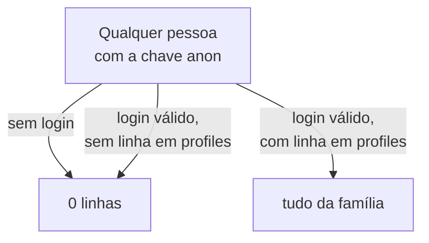

# Segurança

## Verificação automática

```bash
node scripts/verificar-seguranca.mjs
```

Audita o setup inteiro e lista o que está aberto. Não altera nada e não
imprime nenhum segredo — só comprimentos e vereditos. Sai com código 1 se
houver falha, então serve em hook de pre-push.

O que ele checa:

| Área | Verificação |
|---|---|
| git | arquivos de segredo versionados, JWT no histórico, e-mail pessoal nos commits |
| local | `familia.json` em pasta sincronizada com nuvem, força do `CRON_SECRET` |
| senhas | comprimento e se contêm nome, e-mail ou termos de lista de ataque |
| supabase | cadastro público aberto, provedores OAuth ligados sem uso |
| dependências | vulnerabilidades altas e críticas |

---

## Endurecimento: o que só você pode fazer

Nenhuma dessas é código. São as que mais importam.

### 1. Rotacionar tudo que já apareceu em tela

Credencial que passou por print, chat ou screenshot deve ser considerada
pública. Rotacionar é barato; descobrir que vazou, não.

### 2. Fechar o cadastro público

**Authentication → Sign In / Providers → desligar "Allow new users to sign
up".**

A chave anon está dentro do APK, e extrair strings de um APK é trivial. Com o
cadastro aberto, qualquer pessoa cria conta no seu projeto. Ela não verá dado
algum — o RLS exige linha em `profiles` —, mas é superfície de ataque de graça
e consumo da sua cota de e-mail.

Com o cadastro fechado, contas nascem apenas pelo
`scripts/sincronizar-familia.mjs`, com a service role.

### 3. Ligar proteção contra senha vazada

**Authentication → Policies → "Prevent use of leaked passwords".** O Supabase
consulta o HaveIBeenPwned por hash parcial e recusa senhas que já apareceram
em vazamentos conhecidos.

### 4. Segundo fator nas contas que sustentam tudo

Supabase, GitHub e Expo. Quem entrar na sua conta Supabase não precisa hackear
nada: lê o banco pelo painel.

### 5. Senhas de 16+ caracteres aleatórios

Comprimento vence complexidade. `EFT9jsZ9VzuDAESw` resiste a força bruta
muito melhor que `Joao9192!`, e é mais fácil de guardar num gerenciador do
que de lembrar — que é exatamente onde ela deve estar.

```bash
node -e "console.log(require('node:crypto').randomBytes(12).toString('base64url'))"
```

### 6. O computador

O `familia.json` reúne a service role key e as senhas de todo mundo. Quem tem
acesso a essa máquina tem acesso a tudo — nenhuma configuração de servidor
muda isso.

| | Por quê |
|---|---|
| BitLocker ligado | Disco roubado vira só um disco |
| Windows Update em dia | A maioria das invasões usa falha já corrigida |
| Defender ativo, com proteção contra ransomware | O básico, que funciona |
| Sem software pirata | Vetor número um de infostealer no Brasil |
| Gerenciador de senhas | Em vez de reusar a mesma senha em tudo |
| Conta de usuário sem privilégio de administrador no dia a dia | Limita o estrago de um clique errado |

Infostealer é o que de fato ameaça este projeto: um malware que varre o disco
atrás de arquivos como `.env` e `familia.json` e os envia. Ele não precisa
quebrar criptografia nenhuma — só precisa que você execute um instalador
baixado de onde não devia.

---

## Por que "impossível de hackear" não é uma meta

Não existe sistema inviolável. O que existe é custo de ataque acima do valor
do alvo. Este projeto não guarda dinheiro nem permite mover dinheiro — a API
da Pluggy é somente leitura. O pior caso é alguém descobrir onde sua família
faz compras.

Contra o atacante realista — alguém que ache o repositório, ou um malware que
varra o disco —, as medidas acima são o que importa. Contra um adversário com
recursos de Estado interessado especificamente em você, nenhuma configuração
de Supabase resolveria, e o problema não seria este app.

Este projeto lê extrato bancário. O que está em jogo, se algo der errado, é o
histórico financeiro completo de uma família — quanto entra, quanto sai, onde
compra, quando viaja. Este documento diz onde cada segredo mora, o que protege
o quê, e o que fazer quando algo vazar.

## Os quatro segredos

| Segredo | Onde vive | Se vazar |
|---|---|---|
| `PLUGGY_CLIENT_SECRET` | Secrets da Edge Function | **Grave** — acesso ao extrato |
| `SUPABASE_SERVICE_ROLE_KEY` | Só na máquina do administrador | **Grave** — ignora o RLS inteiro |
| `CRON_SECRET` | Secrets da Edge Function | Baixo — só dispara sincronizações |
| `EXPO_PUBLIC_SUPABASE_ANON_KEY` | Dentro do APK | Nenhum — é pública por definição |

### Por que a chave anon pode ficar no app

Ela identifica o projeto, não autoriza nada por si. Quem a tiver consegue
apenas bater na API do Supabase; o que pode ler ou escrever é decidido pelo
Row Level Security, e o RLS exige uma sessão autenticada cuja `auth.uid()`
tenha linha em `profiles`.

Uma pessoa com a chave anon e sem login enxerga zero linhas. É por isso que a
chave pode ser embutida no APK sem problema — e é por isso que as policies
precisam estar certas.

### Por que a service_role nunca sai da sua máquina

Ela **ignora o RLS por completo**. Com ela, qualquer um lê e escreve qualquer
tabela. Ela existe para o script de cadastro de membros e para a própria Edge
Function (onde a Supabase a injeta automaticamente, sem passar por você).

Nunca deve entrar num arquivo do repositório, num APK, numa variável do Expo,
nem numa mensagem de chat.

## O modelo de acesso



Tudo se apoia numa única função:

```sql
create function public.eh_da_familia()
returns boolean
language sql stable security definer
set search_path = public
as $$
  select exists (select 1 from public.profiles where id = auth.uid());
$$;
```

O `security definer` **não é opcional**. Sem ele, a policy de `profiles`
consultaria `profiles` com o RLS ligado, que chamaria a policy de novo, em
recursão infinita. Rodando como dono, a função ignora o RLS na sua própria
consulta e quebra o ciclo.

O `set search_path = public` tampa o outro buraco: sem ele, uma função
`security definer` pode ser induzida a resolver `profiles` para um schema
plantado pelo atacante.

### Consequência prática

Criar o login de alguém **não** dá acesso. É preciso também a linha em
`profiles`. Isso é intencional: se o cadastro público do Supabase for ligado
por engano, os estranhos que se cadastrarem verão um app vazio.

O script `scripts/criar-membro.mjs` faz os dois passos justamente porque
esquecer o segundo é silencioso — a pessoa loga e vê tudo zerado, sem erro.

## A fronteira dos segredos da Pluggy

```text
┌─────────────────────────────────┐
│  Edge Function sync-pluggy      │   ← clientId e clientSecret vivem AQUI
│  Deno, na infra da Supabase     │      e só aqui
└──────────────┬──────────────────┘
               │  grava dados já traduzidos
               ▼
┌─────────────────────────────────┐
│  Postgres                       │
└──────────────┬──────────────────┘
               │  lê sob RLS
               ▼
┌─────────────────────────────────┐
│  App no celular                 │   ← nunca vê credencial de banco
└─────────────────────────────────┘
```

O app não tem como falar com a Pluggy nem que quisesse: ele não conhece a
credencial, e a Edge Function não expõe nenhuma rota que repasse dados brutos.

## Autenticação da própria função

`sync-pluggy` é publicada com `--no-verify-jwt`. Isso desliga a checagem **do
gateway** da Supabase, não a autenticação — ela é feita dentro da função:

```ts
// ou o header secreto do agendamento...
const veioDoCron = Boolean(segredoCron) && req.headers.get('x-cron-secret') === segredoCron;

// ...ou um usuário com linha em profiles
if (!veioDoCron) {
  const { data: { user } } = await comoUsuario.auth.getUser();
  if (!user) return json({ ok: false, erro: 'Sessao invalida.' }, 401);
  const { data: perfil } = await admin.from('profiles').select('id').eq('id', user.id).maybeSingle();
  if (!perfil) return json({ ok: false, erro: 'Usuario nao faz parte da familia.' }, 403);
}
```

O gateway precisa ficar de fora porque o agendamento (`pg_cron` + `pg_net`)
chama a função sem token de usuário — ele tem o `CRON_SECRET`, não um JWT.

## O que fazer quando algo vazar

### Client Secret da Pluggy

1. Dashboard da Pluggy → **Aplicações** → ⚙️ → **Credenciais** → regenerar
2. Atualizar `supabase/.env.secrets`
3. `npx supabase@latest secrets set --env-file supabase/.env.secrets`
4. Republicar a função

O Client ID sozinho não abre nada — só o par funciona.

### service_role key

Painel do Supabase → **Configurações → Chaves de API** → revogar e gerar
outra. Enquanto isso não for feito, considere o banco comprometido: quem tem a
chave lê tudo.

### CRON_SECRET

Editar o arquivo e rodar o `secrets set` de novo. O dano possível é alguém
disparar sincronizações — incômodo e consumo de cota, não vazamento.

### Senha de um membro

```bash
node scripts/criar-membro.mjs "email@dele.com" "novaSenha" "Nome"
```

O script redefine a senha quando o usuário já existe.

## O repositório é público

O que fica de fora, e por quê:

| Arquivo | Conteúdo | Ignorado em |
|---|---|---|
| `familia.json` | Senhas dos membros e a service role key | `.gitignore` |
| `mobile/.env` | URL e chave anon do projeto | `mobile/.gitignore` |
| `supabase/.env.secrets` | Credenciais da Pluggy | `.gitignore` |
| `supabase/.temp/` | Estado local da CLI | `.gitignore` |

Cada um tem um par `.example` versionado, com placeholders no lugar dos
valores reais.

> `familia.json` é o arquivo mais sensível do projeto: reúne, num lugar só, a
> service role key e as senhas de todo mundo. Ele existe porque gerenciar
> acesso de três pessoas por linha de comando é convidativo ao erro — mas
> mantenha-o nesta máquina e fora de backup em nuvem sincronizada.

Os arquivos `.example` trazem `00000000-0000-...` no lugar dos identificadores
reais. O e-mail dos commits é o `@users.noreply.github.com` do GitHub, não o
pessoal.

**Antes de qualquer push**, vale conferir:

```bash
git ls-files | grep -E "\.env$|\.env\.secrets$"     # deve não retornar nada
git grep -niE "eyJhbGciOi[A-Za-z0-9_-]{20,}" HEAD   # nenhum JWT real
```

## O que este projeto não faz

**Não criptografa dados em repouso além do que a Supabase já faz.** Os valores
das transações estão em claro nas colunas. Para o modelo de ameaça de uma
família — proteger contra quem pega o celular ou acha o repositório —, o RLS e
a separação de segredos bastam. Para algo maior, não bastariam.

**Não tem auditoria de leitura.** A tabela `sincronizacoes` registra escritas
do sincronizador; ninguém registra quem abriu qual tela.

**Não tem segundo fator.** O acesso ao app é e-mail e senha. Ligar MFA no
Supabase Auth é possível e não foi feito.

**Confia em todo membro da família.** Quem entra vê e edita tudo, inclusive
apagar lançamentos manuais. Não há papéis nem permissões separadas — é uma
decisão de produto, não um descuido.
