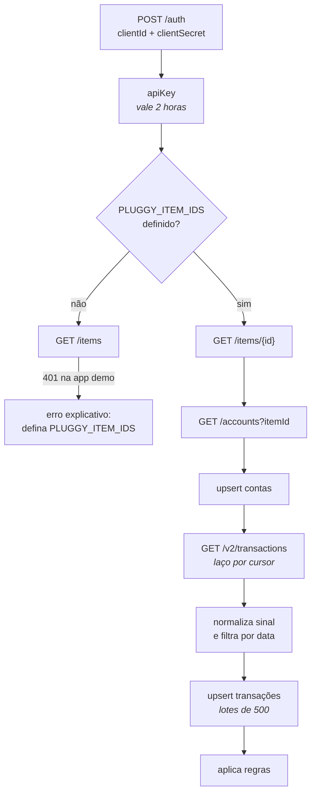

# Sincronização com a Pluggy

Tudo que este documento descreve acontece em
[`supabase/functions/sync-pluggy/index.ts`](../supabase/functions/sync-pluggy/index.ts).

A maior parte do que está aqui foi descoberta batendo na API, não lendo a
documentação — vários comportamentos divergem do que a referência descreve.
Cada armadilha está registrada com o erro exato que ela produz, para quem
tropeçar reconhecer.

## Os dois Pluggys

Confundir os dois custa horas, então vale separar:

| | O que é | Onde |
|---|---|---|
| **Meu Pluggy** | Produto para pessoa física. Você conecta seus bancos e consente. Grátis, sem prazo. | `meu.pluggy.ai` |
| **Dashboard Pluggy** | Produto para desenvolvedor. De onde saem `clientId` e `clientSecret`. | `dashboard.pluggy.ai` |

São a **mesma conta**. As conexões moram no primeiro, a credencial sai do
segundo, e um item conectado no Meu Pluggy só aparece para a API depois de
**vinculado à aplicação** no Dashboard.

> **O aviso de "trial expirado" no Dashboard não afeta o uso pessoal.** Ele é
> da trilha comercial — webhooks obrigatórios, due diligence, acesso a dados
> reais de terceiros. Para ler as próprias contas via Meu Pluggy, nada disso
> se aplica.

**Limite do plano gratuito:** 5 conexões ativas, todas do mesmo CPF.

## O fluxo



---

## Armadilha 1 — `GET /items` responde 401

```json
{"message":"Unauthorized","code":401}
```

Com credenciais **válidas**. O `POST /auth` passa, devolve a `apiKey`, e a
listagem de items recusa mesmo assim.

A aplicação demo do Meu Pluggy não tem permissão de listagem. Como o `/auth`
já funcionou, o problema nunca é a credencial — é a permissão.

**Solução:** apontar o item pelo ID. Ele aparece no Dashboard, em
**Aplicações → Demo**, no topo do item conectado.

```bash
PLUGGY_ITEM_IDS=00000000-0000-0000-0000-000000000000
```

A função tenta listar e, ao receber 401 ou 403, devolve uma mensagem dizendo
exatamente isso em vez de repassar o erro cru.

---

## Armadilha 2 — `GET /transactions` está morto

```json
{"message":"This endpoint is deprecated. Use GET /v2/transactions with cursor pagination instead.",
 "code":410,"codeDescription":"ENDPOINT_DEPRECATED"}
```

A documentação ainda descreve o endpoint antigo, com `page` e `totalPages`.
Ele responde **410 Gone**. A referência dizia que só sairia do ar no fim de
2026; saiu antes.

---

## Armadilha 3 — o v2 recusa `from` e `pageSize`

Migrar para `/v2/transactions` mantendo os parâmetros antigos dá:

```json
{"message":"property from should not exist, property pageSize should not exist","code":400}
```

O v2 aceita **apenas** `accountId` e o cursor. Sem filtro de data, sem
tamanho de página.

Consequência: baixamos tudo e recortamos depois.

```ts
return todas.filter((t) => (t.date ?? '').slice(0, 10) >= desde);
```

Custa algumas páginas a mais e, de brinde, traz o histórico completo em vez de
uma janela.

---

## Armadilha 4 — o `next` é uma query string solta

A resposta do v2 é `{ results, next }`. E o `next` vem assim:

```text
?accountId=00000000-0000-0000-0000-000000000000&after=MjAyNS0xMC0xNFQwMToyNjozMC4wMTha...%3D%3D
```

**Começando com `?`, sem caminho nenhum.** Tratar isso como caminho relativo
produz `https://api.pluggy.ai/?accountId=...` — a raiz da API, que responde:

```json
{"message":"Forbidden"}  // 403
```

Um 403 que não tem nada a ver com permissão. É só a URL errada.

Além disso, o cursor é **base64 já codificado** (`%3D%3D` são os `==` do fim).
Remontar a URL com `URLSearchParams` re-escapa o `%` e o cursor deixa de
valer.

A função cobre os quatro formatos possíveis e usa o valor como veio:

```ts
function proximaPagina(next: string | null | undefined, accountId: string): string | null {
  const valor = (next ?? '').trim();
  if (!valor) return null;
  if (valor.startsWith('http://') || valor.startsWith('https://')) return valor;
  if (valor.startsWith('?')) return `${PLUGGY_API}/v2/transactions${valor}`;   // ← o caso real
  if (valor.startsWith('/')) return PLUGGY_API + valor;
  if (valor.startsWith('v2/')) return `${PLUGGY_API}/${valor}`;
  return `${PLUGGY_API}/v2/transactions?accountId=${accountId}&after=${valor}`;
}
```

Quando uma página falha, o erro carrega o valor literal do `next` recebido —
sem isso, diagnosticar paginação vira tentativa e erro.

---

## Armadilha 5 — `in` com muitos ids estoura a URL

O PostgREST monta filtros na query string. Perguntar "quais destes 500 ids já
existem?" gera uma URL de ~18 KB e leva um **414 URI Too Long**.

A pergunta foi trocada por uma equivalente, com filtro por janela:

```ts
const { data: existentes } = await db
  .from('transacoes')
  .select('id')
  .eq('conta_id', conta.id)
  .gte('data', desde);
```

Pelo mesmo motivo, os upserts vão em lotes de 500 e os updates de regras em
lotes de 100.

---

## Autenticação da função

Dois caminhos aceitos:

```ts
// Agendamento: header secreto
const veioDoCron = Boolean(segredoCron) && req.headers.get('x-cron-secret') === segredoCron;

// App: JWT de um usuário que esteja em profiles
```

Publicada com `--no-verify-jwt`, porque o agendamento não tem JWT. A
autenticação real está dentro da função — ver [segurança](seguranca.md).

## Janela de tempo

Padrão: 90 dias. O corpo da requisição controla:

```jsonc
{}                    // 90 dias
{ "dias": 365 }       // um ano
{ "completo": true }  // 730 dias
```

Como o v2 não filtra por data, a janela é sempre um recorte local — mudá-la
não muda quantas páginas são baixadas.

## Idempotência

A chave primária de `transacoes` é o id da Pluggy. Rodar duas vezes seguidas
atualiza as mesmas linhas em vez de duplicar. O contador de `novas` compara
com os ids já conhecidos da janela; é informativo, não transacional.

## Diagnóstico

```sql
select iniciada_em, terminada_em, sucesso, contas, novas, erro
from sincronizacoes
order by iniciada_em desc
limit 10;
```

Erros comuns e o que significam:

| Mensagem | Causa |
|---|---|
| `PLUGGY_CLIENT_ID ... nao configurados` | Os secrets não foram gravados |
| `/auth respondeu 401` | Credencial errada ou regenerada sem atualizar |
| `nao tem permissao para listar items` | Falta `PLUGGY_ITEM_IDS` |
| `Nenhuma conexao encontrada` | Item não vinculado à aplicação |
| `Could not find the table 'public.contas'` | O schema não foi aplicado |
| `Sem autorizacao.` | `x-cron-secret` não bate com o secret |
